

# I O N

collect any interestring thoughts.

---

收集了大大小小的插件，并尽力推崇原生的实现，减少依赖库，松耦合。本来想传效果图，但是太大了，报erron54无解上不去，就不上传了。

---

includes:

- UI
  - Background [背景特效]
    - backmatrix  [黑客帝国]
    - cursor-follow  [鼠标跟随]
    - snow-around  [雪景]
    - star-galaxy  [星系]
  - Component [基本组件]
    - banner  [轮播图]
    - city && select  [城市选择器]
    - date  [日期选择器]
    - hint  [文字提示]
    - loader  [加载中]
    - multitab  [目录切换]
    - scroll-sound  [会放屁的滚动条]
    - sort_drag  [可拖拽的表格]
  - Image-Effects [图像效果]
    - mulity-filter  [css滤镜]
    - glitch  [行尸走肉]
    - tilt  [视觉欺骗]
  - Layout [布局选项]
    - block  [块布局]
    - inline  [行内布局]
    - carrousel  [旋转木马]
  - Media [媒体]
    - nav-pure  [动画导航-expand]
    - nav-water  [动画导航-wave]

---

#### Show List

> backmatrix

> cursor-follow

> snow-around

> star-galaxy

> banner

> city

> date

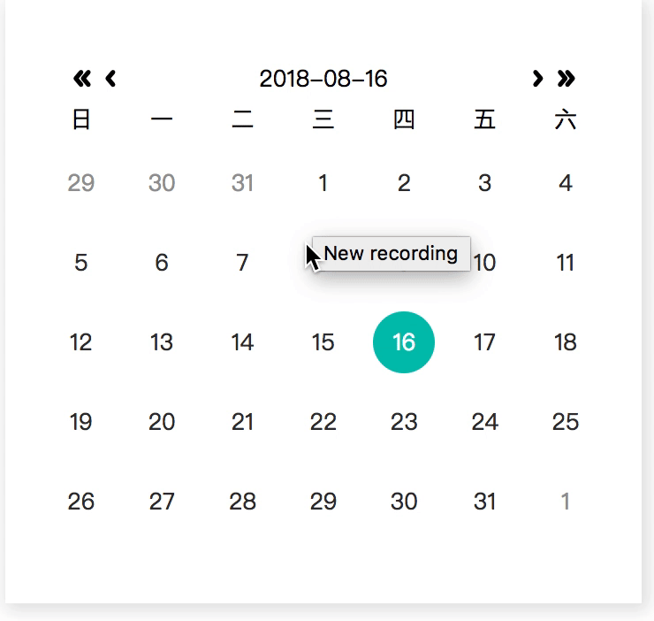

> hint

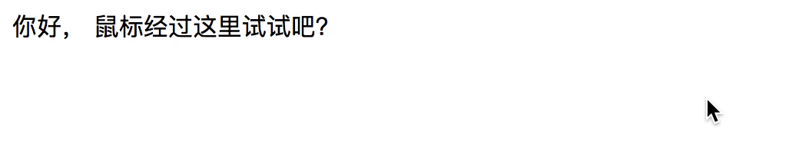

> loader

> multitab

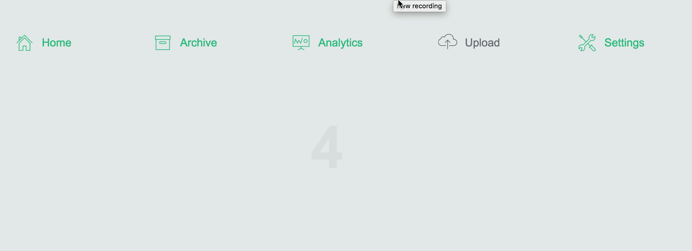

> scroll-sound 

这个没有截屏，因为是声音~

> input hint

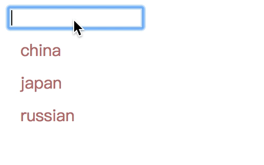

> sort_drag

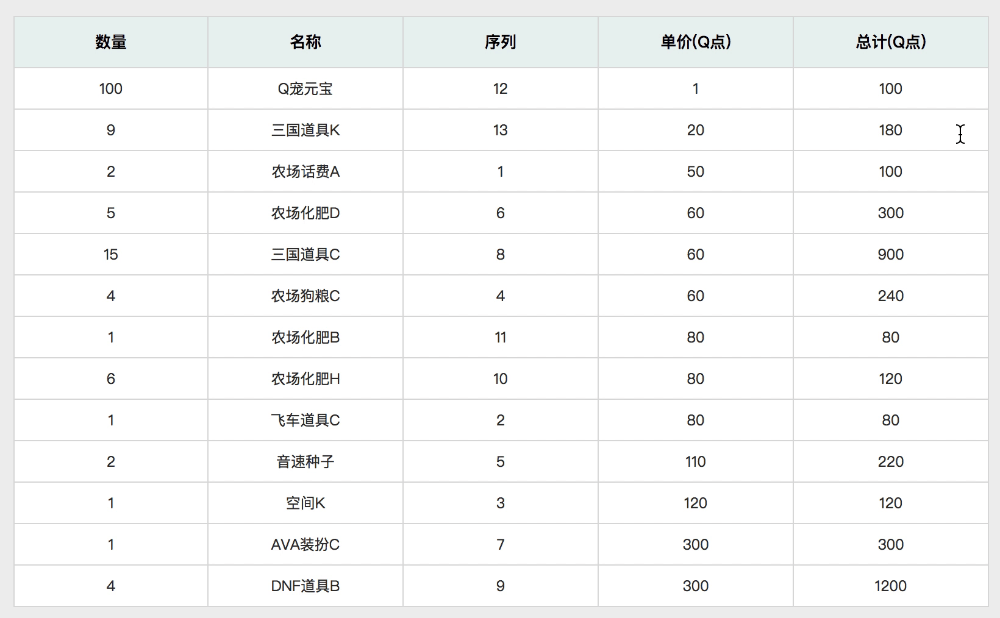

> mulity-filter

> glitch

> tilt

> grail 常规布局

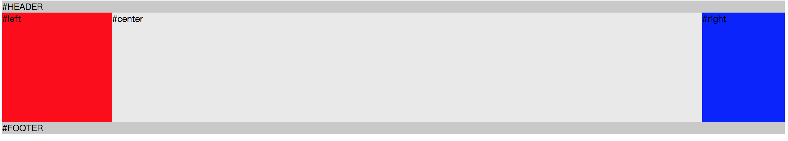

> flex 常规布局

> grid 常规布局

> position 常规布局

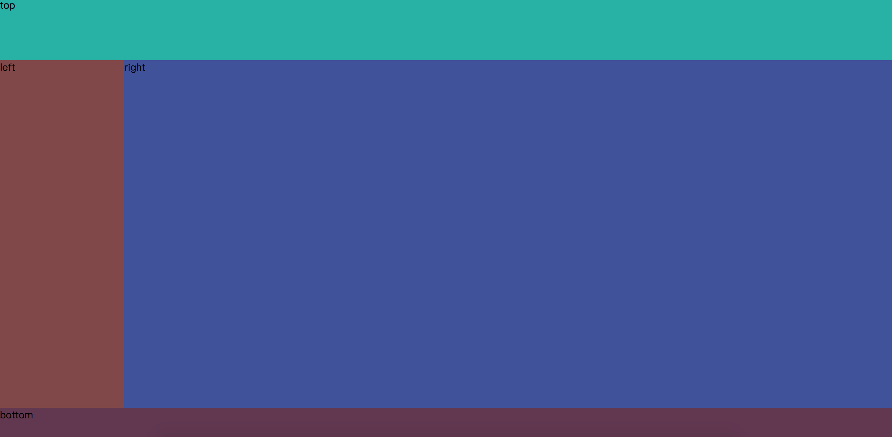

> 视觉差

> grid 瀑布流

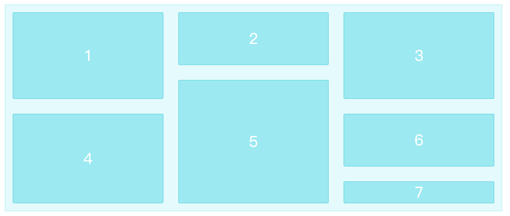

> 常规 瀑布流

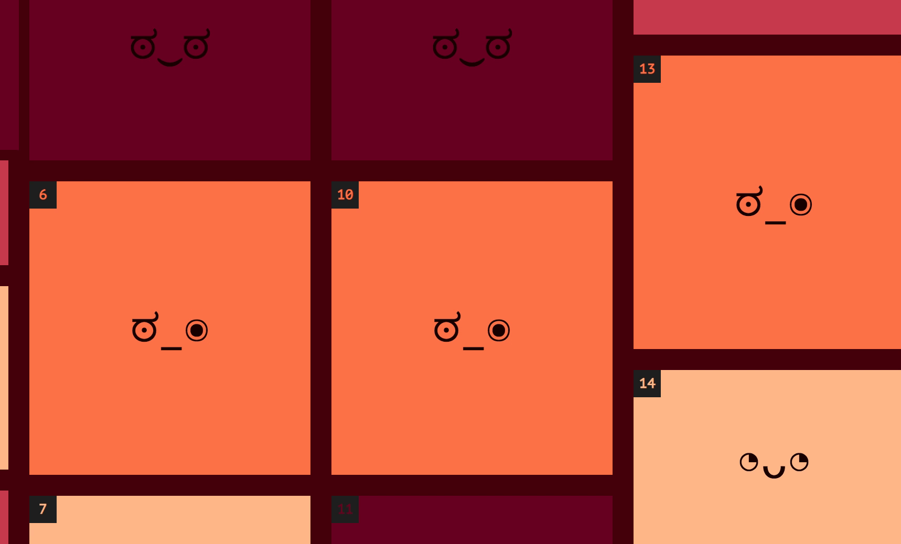

> 行内grid

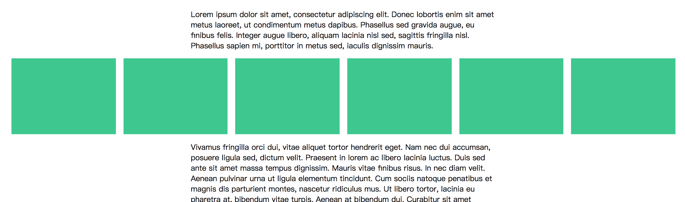

> img cover

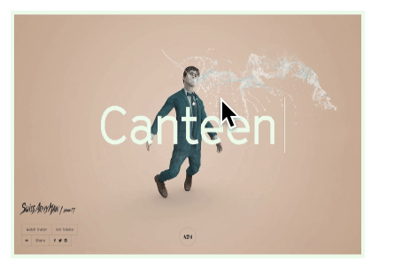

> img 居中

> text 样式

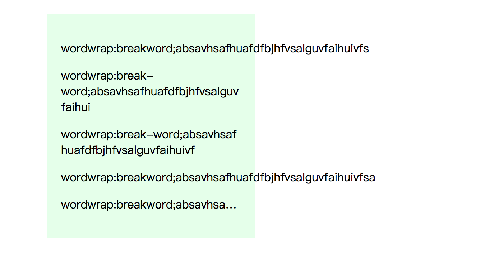

> 卡片机制

> pure nav

> ripple nav

----NO END ----
